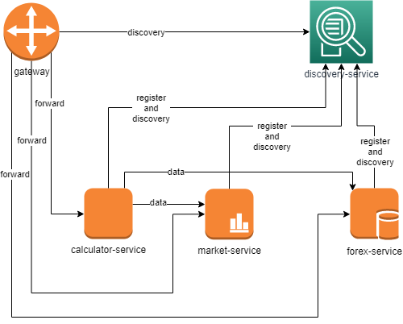

# Read Me First

A microservice-based architecture for financial services.

The goals of the project are:

* Highly maintainable and testable
* Loosely coupled
* Independently deployable
* Organized around business capabilities
* Owned by a small team

With attention to:

* Domain and services boundaries
* Integration between services

To keep the microservices simple, the following features will not be covered in the project:

> * metrics or dashboard (grafana, graylog, etc)
> 
> because already covered by [java-metrics](https://github.com/albertominetti/java-metrics)

> * centralized logging or any logging setup
> * docker
> * tracing
> * complex balancing / redundancy / failover / circuit breaker
>
> because already covered by [java-discovery](https://github.com/albertominetti/java-discovery)

> * security and certificates
> * pipelines, mvn clean verify should be enough

# Architecture

# Launch the services

The simplest way to run all the services is in the local machine using the following statements

    mvn clean verify
    
    java -jar discovery-service/target/*.jar &
    java -jar calculator-service/target/*.jar &
    java -jar forex-service/target/*.jar &
    java -jar market-service/target/*.jar &
    java -jar gateway-service/target/*.jar &

